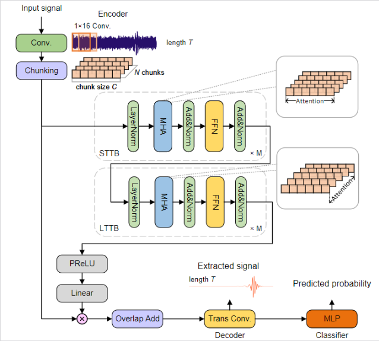

# Space-based gravitational wave signal detection and extraction with deep neural network

[](https://opensource.org/licenses/MIT) [](https://arxiv.org/abs/2207.07414)

## Introduction

<p align="justify">
Space-based gravitational wave (GW) detectors will be able to observe signals from sources that are otherwise nearly impossible from current ground-based detection. Consequently, the well established signal detection method, matched filtering, will require a complex template bank, leading to a computational cost that is too expensive in practice. Here, we develop a high-accuracy GW signal detection and extraction method for all space-based GW sources. As a proof of concept, we show that a science-driven and uniform multi-stage deep neural network can identify synthetic signals that are submerged in Gaussian noise. Our method has more than 99% accuracy for signal detection of various sources while obtaining at least 95% similarity compared with target signals. We further demonstrate the interpretability and strong generalization behavior for several extended scenarios.
</p>

## Getting started

Our model is developed on top of the [SpeechBrain](https://speechbrain.github.io/) toolkit. To set up the environment and install necessary dependencies, run the following command in your terminal:

```bash
conda env create -f environment.yml
```

Additionally, you need to install the [FastEMRIWaveform](https://github.com/BlackHolePerturbationToolkit/FastEMRIWaveforms) package to generate the EMRI dataset. Follow the instructions provided on their repository to complete the installation.

## Training the Model

To generate datasets for training, you can use the following functions in `gwdataset.py`:

```python
generate_emri_dataset()
generate_smbhb_dataset()
generate_bwd_dataset()
generate_sgwb_dataset()
generate_noise_dataset()
```

After generating the dataset, specify the path to the dataset folder and the dataset file names in the configuration file `se-mlp.yaml`:

```yaml
data_folder: path-to-dataset-folder
data_hdf5: dataset-file-name
noise_hdf5: pure-noise-dataset-file-name
```

Finally, train the model by running the following command in your terminal:

```bash
python train_se_mlp se-mlp.yaml
```

## Model Architecture



## Citation

If you find our code useful, please consider citing the following papers:

```bibtex
@misc{zhao2022spacebased,
  title={Space-based gravitational wave signal detection and extraction with deep neural network},
  author={Tianyu Zhao and Ruoxi Lyu and Zhixiang Ren and He Wang and Zhoujian Cao},
  year={2022},
  eprint={2207.07414},
  archivePrefix={arXiv},
  primaryClass={gr-qc}
}

@misc{speechbrain,
  title={{SpeechBrain}: A General-Purpose Speech Toolkit},
  author={Mirco Ravanelli and Titouan Parcollet and Peter Plantinga and Aku Rouhe and Samuele Cornell and Loren Lugosch and Cem Subakan and Nauman Dawalatabad and Abdelwahab Heba and Jianyuan Zhong and Ju-Chieh Chou and Sung-Lin Yeh and Szu-Wei Fu and Chien-Feng Liao and Elena Rastorgueva and François Grondin and William Aris and Hwidong Na and Yan Gao and Renato De Mori and Yoshua Bengio},
  year={2021},
  eprint={2106.04624},
  archivePrefix={arXiv},
  primaryClass={eess.AS},
  note={arXiv:2106.04624}
}

@article{Katz_2021,
	doi = {10.1103/physrevd.104.064047},
	url = {https://doi.org/10.1103%2Fphysrevd.104.064047},
	year = 2021,
	month = {sep},
	publisher = {American Physical Society ({APS})},
	volume = {104},
	number = {6},
	author = {Michael L. Katz and Alvin J.{\hspace{0.167em}
}K. Chua and Lorenzo Speri and Niels Warburton and Scott A. Hughes},
	title = {Fast extreme-mass-ratio-inspiral waveforms: New tools for millihertz gravitational-wave data analysis},
	journal = {Physical Review D}
}
```
