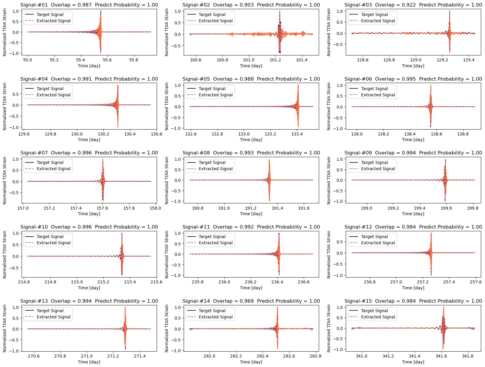

# Space-based Gravitational Wave Signal Detection and Extraction with Deep Neural Network

<p align="justify">
Welcome to the official repository for our paper titled "Space-based Gravitational Wave Signal Detection and Extraction with Deep Neural Network". You can read the open-access article at <a href="https://www.nature.com/articles/s42005-023-01334-6">https://www.nature.com/articles/s42005-023-01334-6</a>. We developed the model using the PyTorch framework. Our aim with this repository is not only to share our implementation but also to provide a comprehensive guide, ensuring it's user-friendly and easy for others to build upon.
</p>


[](https://opensource.org/licenses/MIT) 
[](https://arxiv.org/abs/2207.07414) 
[](https://www.nature.com/articles/s42005-023-01334-6)

## Introduction

<p align="justify">
Space-based gravitational wave (GW) detectors will be able to observe signals from sources that are otherwise nearly impossible from current ground-based detection. Consequently, the well established signal detection method, matched filtering, will require a complex template bank, leading to a computational cost that is too expensive in practice. Here, we develop a high-accuracy GW signal detection and extraction method for all space-based GW sources. As a proof of concept, we show that a science-driven and uniform multi-stage deep neural network can identify synthetic signals that are submerged in Gaussian noise. Our method has more than 99% accuracy for signal detection of various sources while obtaining at least 95% similarity compared with target signals. We further demonstrate the interpretability and strong generalization behavior for several extended scenarios.
</p>

## Result

Showcase of the denoise performance of different type of GW waveform:
<object data="image/fig7.pdf" type="application/pdf" width="700px" height="700px">
    <embed src="image/fig7.pdf">
        <p>This browser does not support PDFs.</p>
    </embed>
</object>
<!--  -->

## Getting started

Our model is developed on top of the [SpeechBrain](https://speechbrain.github.io/) toolkit. To set up the environment and install necessary dependencies, run the following command in your terminal:

```bash
conda env create -f environment.yml
```

Additionally, you need to install the [FastEMRIWaveform](https://github.com/BlackHolePerturbationToolkit/FastEMRIWaveforms) package to generate the EMRI dataset. Follow the instructions provided on their repository to complete the installation.

## Training the Model

To generate datasets for training, you can use the following functions in `gwdataset.py`:

```python
generate_emri_dataset()
generate_smbhb_dataset()
generate_bwd_dataset()
generate_sgwb_dataset()
generate_noise_dataset()
```

After generating the dataset, specify the path to the dataset folder and the dataset file names in the configuration file `se-mlp.yaml`:

```yaml
data_folder: path-to-dataset-folder
data_hdf5: dataset-file-name
noise_hdf5: pure-noise-dataset-file-name
```

Finally, train the model by running the following command in your terminal:

```bash
python train_se_mlp.py se-mlp.yaml
```

## Model Architecture


## Citation

If you find our code useful, please consider citing the following papers:

```bibtex
@article{zhao_space-based_2023,
  title = {Space-Based Gravitational Wave Signal Detection and Extraction with Deep Neural Network},
  author = {Zhao, Tianyu and Lyu, Ruoxi and Wang, He and Cao, Zhoujian and Ren, Zhixiang},
  year = {2023},
  month = aug,
  journal = {Communications Physics},
  volume = {6},
  number = {1},
  pages = {212},
  doi = {10.1038/s42005-023-01334-6},
}

```

## Reference

We would like to express our gratitude to the following repositories for their invaluable contributions to this work:

- [SpeechBrain](https://speechbrain.github.io/)
- [FastEMRIWaveform](https://github.com/BlackHolePerturbationToolkit/FastEMRIWaveforms)
- [cnn_matchfiltering](https://github.com/hagabbar/cnn_matchfiltering)
- [lfi-gw](https://github.com/stephengreen/lfi-gw)
